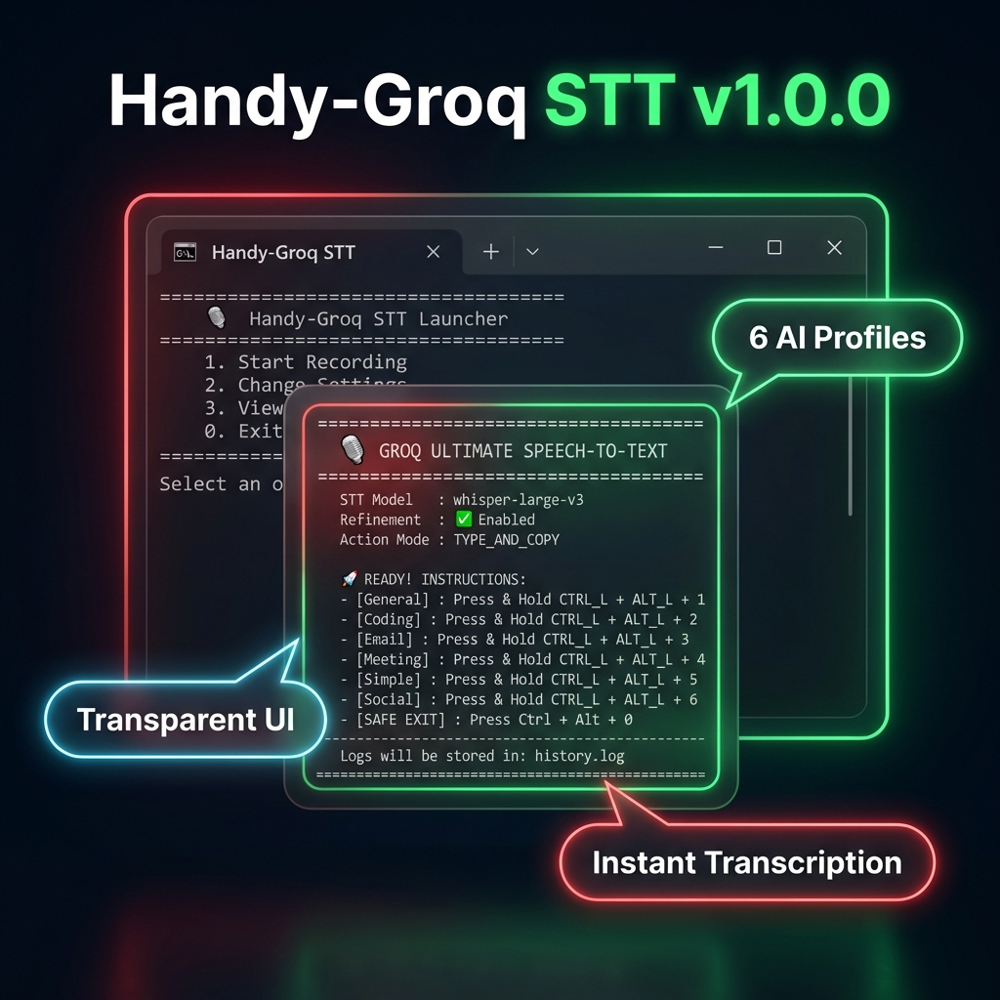
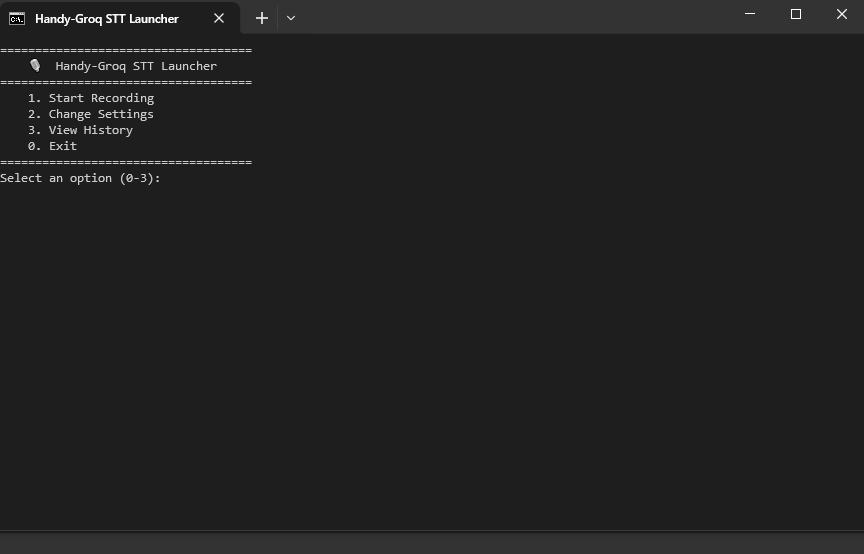

# 🎙️ Handy-Groq STT

[](https://www.gnu.org/licenses/gpl-3.0)



**Handy-Groq: Press, speak, and watch your thoughts turn into perfectly refined text in any application.**

A high-performance, context-aware AI voice assistant that transcribes and auto-types refined text via global hotkeys. Now supporting **Windows, Linux, and macOS**. Built with Groq's Whisper-large-v3 for near-instant speed and LLM refinement for professional results.



---

## ✨ Features

- 🚀 **Extreme Speed**: Powered by Groq's Whisper-large-v3-turbo.
- 🧠 **Context-Aware Refinement**: Optional AI layer to fix grammar, punctuation, and "ums/ahs".
- 📥 **System Tray Icon**: Runs in the background with a quick-access menu for toggling features.
- 🏁 **Windows Auto-start**: Optional setting to launch automatically on login.
- ⌨️ **Global Hotkeys**: Uses `Ctrl + Alt + Number` combos for instant activation.
- 🪄 **Auto-Type & Copy**: Automatically types into active windows via `Ctrl+V` and copies to clipboard.
- 🎨 **Premium Visual Widget**: A floating pill featuring vibrant emojis (🎙, 🤖, ✅) and state-aware color cues.
- 🔊 **Sound Cues**: Integrated audio feedback for all states.
- 📜 **Managed Logs**: History is logged in JSON format with automatic 5MB rotation.

---

## 🚀 Setup & Installation

1. **Install Dependencies**:
   ```bash
   pip install -r requirements.txt
   ```
   *Note for macOS users:* To enable the System Tray Icon, you also need:
   ```bash
   pip install pyobjc-framework-Cocoa
   ```

2. **Configure API Key**:
   - Rename `.env.example` to `.env`.
   - Add your [Groq API Key](https://console.groq.com/keys).

3. **Get the Visual Widget (Optional but Recommended)**:
   - Ensure `tkinter` is installed (standard with Python on Windows).

---

## 🎮 Usage

### Launching the App
- **Windows**: Double-click **`run_groq_stt.bat`**.
- **Linux / macOS**: Run `chmod +x run_groq_stt.sh` and then **`./run_groq_stt.sh`**.

### ⌨️ Contextual Profiles
Hold the specific combo to record, then release to transcribe and type:

| Profile | Hotkey | Purpose |
| :--- | :--- | :--- |
| **General** | `Ctrl + Alt + 1` | Standard speech to clear text |
| **Coding** | `Ctrl + Alt + 2` | Documentation & structured code |
| **Email** | `Ctrl + Alt + 3` | Professional business email body |
| **Meeting** | `Ctrl + Alt + 4` | Summarize speech into action items |
| **Simple** | `Ctrl + Alt + 5` | Convert jargon to plain English |
| **Social** | `Ctrl + Alt + 6` | Catchy posts for LinkedIn/X |
| **Safe Exit** | `Ctrl + Alt + 0` | Stop and close the application |

### ⚙️ Settings
Access settings via the **Tray Icon** (right-click) or **CLI** (Option 2):
- Toggle **Auto-start on Windows**.
- Change STT & Refinement Models.
- Toggle Refinement, Sounds, or Logging.
- Edit Prompts and Hotkeys.

---

## 📂 Project Structure
- `main.py`: Core application and UI widget.
- `settings_manager.py`: Interactive CLI for configuration.
- `config.json`: All your custom settings.
- `history.log`: Timestamped JSON entries of all calls.
- `run_groq_stt.bat`: ModernUTF-8 launcher menu.

---

## 📜 License
This project is licensed under the **GNU General Public License v3.0**. See the [LICENSE](LICENSE) file for details.

---
*Inspired by @krishnakanthb13. Optimized for high-productivity workflows.*
