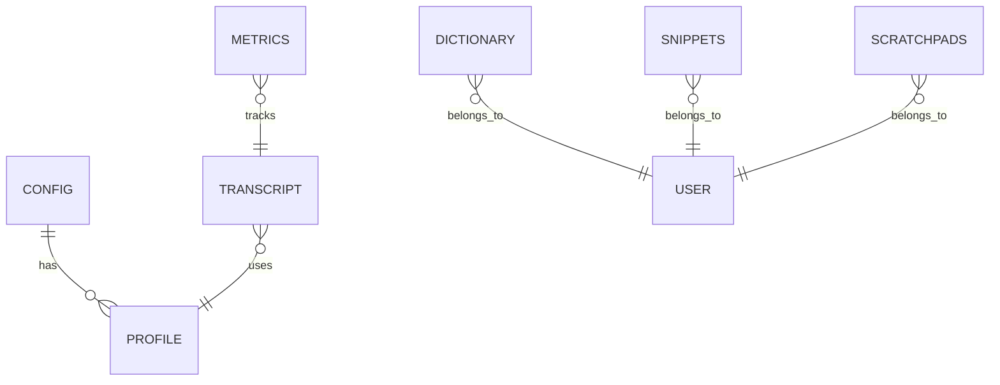
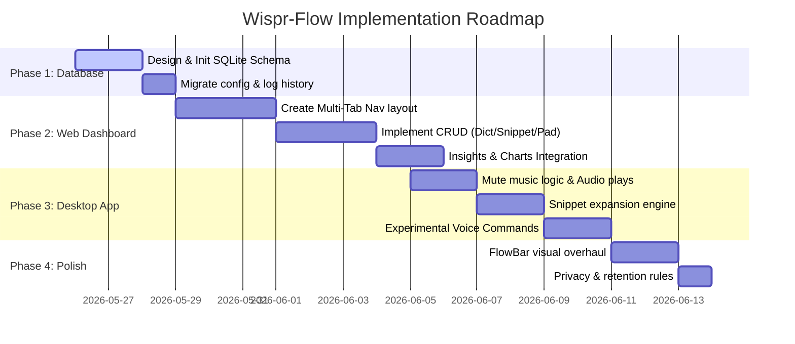

Okay, let's start with the features that Wispr Flow has.

1.  The home screen has an account page where we can see the email address and the plan which is present there, and also has:
    *   Get a free month of free flow
    *   Refer a friend
    *   Manage account
2.  In Manage Account, there is General, and in General there are:
    *   Shortcuts
    *   Microphone
    *   Auto detect
    *   Languages (different languages)
3.  In System, it has:
    *   Launch app at login
    *   Show FlowBar at all times
    *   Show app in dock
    *   Under Sounds, dictation and notification sounds
    *   Mute music while dictating
    *   Notification tips about getting set up with or improving how to use Flow
    *   Announcements
    *   New features or capabilities
    *   Milestone word count
    *   Milestone streak
    *   Referral activity
    *   Scratch pad
    
    *   Always open in new tab
    *   Always open a fresh tab when activated
    *   The scratchpad opens last pinned note
    *   Active note
    *   Jump back to the pinned note when you were last working
    
    *   Under Extras, it has:
        *   Add auto add to dictionary
        *   Add corrected words to words automatically
        *   Creator mode where dictating with Wispr Flow
        *   Smart formatting and data
        *   Under Wipe Coding, it better understands variable in code and file tagging in chat
        *   In Experimental Command Mode, it has:
            *   Enable advanced voice commands
            *   Press enter command
            *   Bulk import command
        *   In Accounts, it has:
            *   First name
            *   Last name
            *   Email
            *   Profile picture
        *   In Plans and Building, you can change with different options
        *   Data and Privacy, we can set:
            *   Data stored locally
            *   Delete the data after 24 hours
            *   Never store data locally
        *   We can also sync notes and retrieve them on a different platform and

---

Okay, the other parts of the Wispr Flow are:

*   The home screen, where it shows the detailed transcripts along with the date and time, copy, send feedback, and more options, something like undo AI edit, retry transcripts, and extract audio.
*   All these features are available for each conversation, and it also has total words, WPM (words per minute), day streak, and voice profile as well.

Coming to Insights, it shows your usage, like:

*   words per minute
*   fixes made by Flow
*   how many words were corrected
*   how many dictionary fixes were done
*   how many total words were dictated
*   how many total news articles were written

It also shows desktop usage, personal messages, AI prompts, documents, other tasks, email work messages, and its metrics. It also shows a streak window: how many days a long streak it is happening, and it also has more or less in the same streak window showing how many words were written on that particular day.  
  
It also has your voice tab under Insights, and it gives a voice profile about all the details used in your transcriptions. The next tab is Dictionary under Dictionary. It gives all the wisdom of all the words that you can add personally and share with the team as well. Personally, you can have unique words added to your dictionary.  
  
Coming to Snippets, a small word can be replaced with a lengthy sentence or an email address or a LinkedIn profile, and that can be shared along with the team as well.  
  
Coming to the style, there are three different styles:

*   Formal
*   Casual
*   Very casual

For personal messages, for work messages, it has the same:

*   Formal
*   Casual
*   Excited

For emails, also formal, casual, excited. Others also formal, casual, excited. It also has an auto clean up mode where it is:

*   None
*   Light
*   Medium
*   High cleanup

Coming to the transformations, we have specific keystrokes for Polish prompt engineer, and you even can create your own transformation. Coming to scratch pads, we can add multiple scratch pads here and there, and there are multiple health particles as well in this Wispr Flow.

---

Okay let's start with the features that Wispr Flow has. First is the home screen and it has an account page where we can see the email address and the plan which is present there and also has a get a free month of free flow refer a friend and manage account. In manage account there is general And in general there is shortcuts microphone auto detect and languages different languages and in system it has a launch app at login show flowbar at all times show app in dock and under sounds dictation and notification sounds. Mute music while dictating notification tips about getting set up with or improving how to use flow announcements new features or capabilities milestone word count milestone streak and referral activity scratch pad always open in new tab always open a fresh tab when activated the scratchpad open last pinned note active note jump back to the pin note when you were last working whenever you opened the extras add auto add to dictionary add corrected words to words automatically creator mode where dictating with whisper flow when dictating smart formatting and data and under wipe coding better understands variable in code and file tagging in chat and in experimental command mode enable advanced voice commands press enter command bulk import command and in accounts first name last name email profile picture and in plans and building you can change with different options data and privacy we can set data stored locally or deleted delete the data after 24 hours never store data locally and we can also sync notes and retrieve them in a different platform and

Okay. The other parts of the Wispr Flow are the home screen where it shows the detailed transcripts along with the date and time copy, send feedback and more options something like undo AI edit, retry transcripts. extract audio. All these features are available for each conversation and it also has total words, WPM, words per minute, day streak, voice profile as well. Coming to Insights, it shows your usage like words per minute and fixes made by Flow. How many words were corrected and how many dictionary fixes were done and how many total words were dictated and how many total news articles were written? And it also shows desktop usage personal messages, AI prompts documents other tasks email work messages and its metrics. And it also shows a street window. How many days a long streak it is happening and it also has more or less in the same streak window showing how many words were written on that particular day. And it also has your voice tab under insights and it gives a voice profile about all the. details used in. Your transcriptions then the next tab is dictionary under dictionary. It gives all the wisdom of all the words that you can add personally and shared with the team as well. Personal you can have unique words added to your dictionary and coming to snippets you can. A small word can be replaced with a lengthy sentence or an email address or a LinkedIn profile and that can be shared along with the team as well and coming to the style there are three different styles formal casual and very casual for personal messages for work messages it has same. Formal Casual Excited for emails also formal casual excited others also formal casual excited and it also has an auto clean up mode where it is none light medium and high cleanup and coming to the transformations. We have specific keystrokes for Polish prompt engineer and you even you can create your own transformation and coming to scratch pads. We can add multiple scratch pads. So here and there are multiple health particles as well in this whisper flow.

---

# Wispr-Flow Implementation Plan

This implementation plan outlines how to integrate the feature set of Wispr Flow into the existing Handy Groq STT codebase (located at `c:\Users\ADMIN\OneDrive\Documents\GitHub\speech-to-text`). 

The plan is designed to be incremental, transitioning from the basic console/hotkey script to a modern, multi-tab local Web Dashboard and background tray service.

---

## 1. Database & Persistence Layer (`database.py`)
Currently, the application uses `config.json` and a JSONL file `history.log` for logs. To support snippets, dictionary, scratchpads, and rich metrics, we will introduce a SQLite database `wispr_flow.db`.



### Table Definitions:
1.  **`transcripts`**:
    *   `id` (INTEGER PRIMARY KEY)
    *   `timestamp` (DATETIME DEFAULT CURRENT_TIMESTAMP)
    *   `profile_id` (INTEGER)
    *   `raw_text` (TEXT)
    *   `refined_text` (TEXT)
    *   `word_count` (INTEGER)
    *   `wpm` (INTEGER)
    *   `audio_path` (TEXT) - Path to the `.wav` file stored in `/assets/audio/` for extraction/retrying
    *   `is_undone` (BOOLEAN DEFAULT FALSE)
2.  **`dictionary`**:
    *   `id` (INTEGER PRIMARY KEY)
    *   `word` (TEXT UNIQUE)
    *   `category` (TEXT) - e.g., "Personal", "Team"
    *   `created_at` (DATETIME DEFAULT CURRENT_TIMESTAMP)
3.  **`snippets`**:
    *   `id` (INTEGER PRIMARY KEY)
    *   `shortcut` (TEXT UNIQUE) - e.g., `;email`
    *   `expansion` (TEXT) - e.g., `contact@wisprflow.ai`
    *   `category` (TEXT) - e.g., "Personal", "Team"
4.  **`scratchpads`**:
    *   `id` (INTEGER PRIMARY KEY)
    *   `title` (TEXT)
    *   `content` (TEXT)
    *   `is_pinned` (BOOLEAN DEFAULT FALSE)
    *   `last_active` (BOOLEAN DEFAULT FALSE)
    *   `updated_at` (DATETIME DEFAULT CURRENT_TIMESTAMP)
5.  **`metrics`**:
    *   `id` (INTEGER PRIMARY KEY)
    *   `date` (DATE DEFAULT CURRENT_DATE)
    *   `category` (TEXT) - e.g., "emails", "personal messages", "code", "documents"
    *   `words_written` (INTEGER)
    *   `words_corrected` (INTEGER)
    *   `dictionary_fixes` (INTEGER)

---

## 2. Web Dashboard UI Upgrade (Flask + HTML/CSS/JS)
We will expand the existing Flask application inside [app.py](file:///c:/Users/ADMIN/OneDrive/Documents/GitHub/speech-to-text/web_server/app.py) and update [index.html](file:///c:/Users/ADMIN/OneDrive/Documents/GitHub/speech-to-text/web_server/templates/index.html) into a fully-fledged, responsive multi-tab glassmorphic dashboard.

```
+---------------------------------------------------------------------------------+
|  🎙️ Wispr Flow Dashboard                                          👤 plan | email |
+---------------------------------------------------------------------------------+
|  [Home]   [Insights]   [Dictionary]   [Snippets]   [Scratchpads]   [Settings]   |
+---------------------------------------------------------------------------------+
|                                                                                 |
|  * HOME:                                                                        |
|    +-------------------------------------------------------------------------+  |
|    | [2026-05-25 15:06] (General) - 45 words | 95 WPM                        |  |
|    | "Let's align on the roadmap..."                                         |  |
|    | [Undo AI Edit]  [Retry Transcription]  [Extract Audio]  [Copy]  [Delete]  |  |
|    +-------------------------------------------------------------------------+  |
|                                                                                 |
|  * INSIGHTS: Charts showing WPM, Streak Window (Heatmap), and usage category.   |
|                                                                                 |
|  * DICTIONARY: Custom vocabulary list [Add Word]                                 |
|                                                                                 |
|  * SNIPPETS: [;email] -> [contact@wisprflow.ai]                                 |
|                                                                                 |
|  * SCRATCHPADS: Editor pane with Pinned Notes / Tabs.                            |
|                                                                                 |
+---------------------------------------------------------------------------------+
```

### A. Home Page (Conversations List)
*   **Transcripts View**: Render each transcript with date, profile, word count, calculated WPM, and active voice profile.
*   **Action Drawer per Entry**:
    *   **Undo AI Edit**: Restore the `raw_text` to the clipboard.
    *   **Retry Transcript**: Re-run the raw transcription file (`audio_path`) through a revised LLM prompt.
    *   **Extract Audio**: Expose a download link for the saved `.wav` file.
    *   **Copy / Delete**: Instant clipboard copies and atomic database deletes.
*   **Top Bar Widgets**: Display the user's **day streak** (calendar-based calculation) and **voice profile** state.

### B. Insights Page (Metrics Visualization)
*   Integrate a light dashboard (using Chart.js or pure CSS columns) representing:
    *   **Average WPM** and total words dictated over time.
    *   **Fixes Tracker**: Total words corrected & dictionary fixes performed.
    *   **Category breakdown**: Pie/Donut chart representing distribution (AI Prompts, Documents, Personal Messages, Emails).
    *   **Streak Calendar**: A grid-based layout visualizer showing word counts per day (GitHub commit style).

### C. Dictionary Manager (CRUD Interface)
*   Simple search list layout.
*   Ability to add unique words (e.g. specialized industry jargon, names).
*   CSV bulk-import/export support.

### D. Snippets Manager (CRUD Interface)
*   Columns for `Shortcut` and `Expansion Sentence`.
*   A toggle to share snippets with a "team" (saved to a mock JSON/DB team structure).

### E. Scratchpads Dashboard
*   Left pane: Lists all scratchpads with a visual star icon for pinned notes.
*   Right pane: A textarea/Markdown editor that auto-saves content to `/api/scratchpads`.
*   Options to "Always open in new tab" and "Always open fresh tab when activated."

---

## 3. Desktop Application Extensions ([main.py](file:///c:/Users/ADMIN/OneDrive/Documents/GitHub/speech-to-text/main.py))
To incorporate the hardware and low-level system settings described:

### A. FlowBar Visual Widget
*   Upgrade the `RecordingIndicator` in [main.py](file:///c:/Users/ADMIN/OneDrive/Documents/GitHub/speech-to-text/main.py) from a simple popup into a slim, semi-transparent bar called **FlowBar** anchored to the edge of the screen.
*   Add configuration inside the UI: `Show FlowBar at all times` vs `Only show during dictation`.

### B. System Audio Integration
*   **Mute Music While Dictating**: Use the Windows Core Audio API via `pycaw` in Python to detect active audio players (like Spotify or Chrome) and mute/unmute them during the recording cycle:
    ```python
    from pycaw.pycaw import AudioUtilities
    def set_system_mute(mute=True):
        sessions = AudioUtilities.GetAllSessions()
        for session in sessions:
            volume = session.SimpleAudioVolume
            if session.Process and session.Process.name() != "python.exe":
                volume.SetMute(1 if mute else 0, None)
    ```
*   **Notification and Dictation Sounds**: Expand `play_sound` to read custom wav files for distinct indicators (start recording, processing, copy-paste complete).

### C. Text Expansion (Snippet Engine)
*   Modify `perform_action` inside [main.py](file:///c:/Users/ADMIN/OneDrive/Documents/GitHub/speech-to-text/main.py). Before clipboard copy and text pasting, run a quick regex replacement check on the `refined_text` against the user's `snippets` database:
    ```python
    def expand_snippets(text):
        # Queries sqlite to fetch all snippets
        snippets = get_all_snippets()
        for shortcut, expansion in snippets.items():
            text = text.replace(shortcut, expansion)
        return text
    ```

### D. Experimental Command Mode (Voice Commands)
*   Add a voice-commands parser in the refinement step. If "Experimental Command Mode" is enabled:
    1.  Parse the raw/refined text for patterns.
    2.  If the text ends with "press enter", strip the word and trigger an atomic Enter keypress: `keyboard_controller.tap(keyboard.Key.enter)`.
    3.  If the text contains command phrases (e.g., "undo that", "delete last sentence"), execute corresponding OS keystrokes instead of writing text.

---

## 4. Advanced Style Settings & Formatting
1.  **Style Options**: Introduce configuration presets for Personal Messages, Emails, and general Work Messages:
    *   `Casual`, `Formal`, `Very Casual`, `Excited`.
2.  **Auto Cleanup Mode**: Integrate LLM prompt clauses to control clean-up levels:
    *   `None`: Raw transcript.
    *   `Light`: Fixes basic typos, preserves speech patterns.
    *   `Medium`: Corrects grammar, removes minor filler words.
    *   `High`: Complete professional rephrasing.
3.  **Wipe Coding Profile**: 
    *   Create a specialized profile prompt that parses variable names into standard camelCase, snake_case, or PascalCase formats, and formats code blocks correctly.
    *   Support `@file` tagging in refinement instructions to fetch surrounding file context.

---

## 5. Step-by-Step Action Items



### Phase 1: Database Transition
1.  Create `database.py` with sqlite setup scripts.
2.  Write migration scripts to move existing `config.json` profiles and `history.log` contents into SQLite.
3.  Update configuration loading functions in [settings_manager.py](file:///c:/Users/ADMIN/OneDrive/Documents/GitHub/speech-to-text/settings_manager.py) and [app.py](file:///c:/Users/ADMIN/OneDrive/Documents/GitHub/speech-to-text/web_server/app.py) to point to SQLite.

### Phase 2: Web Server API & Interface Enhancement
1.  Overhaul [index.html](file:///c:/Users/ADMIN/OneDrive/Documents/GitHub/speech-to-text/web_server/templates/index.html) and add tabbed navigation (using local Javascript to toggle panel visibility).
2.  Add backend REST endpoints inside [app.py](file:///c:/Users/ADMIN/OneDrive/Documents/GitHub/speech-to-text/web_server/app.py):
    *   `GET /api/dictionary` and `POST /api/dictionary/add` / `/delete`
    *   `GET /api/snippets` and `POST /api/snippets`
    *   `GET /api/scratchpads` and `POST /api/scratchpads`
    *   `GET /api/metrics/insights` (aggregation counts)
3.  Implement "Undo AI edit" by returning the raw value from the database upon action click.

### Phase 3: Desktop App Integration (`main.py`)
1.  Add `pycaw` to `requirements.txt` and integrate system volume muting before audio recording hooks.
2.  Implement local audio clip saving during recording into an archive folder, mapping the file paths inside database records.
3.  Hook the snippet expansion function directly inside the post-refinement step.
4.  Implement basic voice commands (e.g. detecting "press enter" at the end of dictation).

### Phase 4: Styling & Privacy Controls
1.  Style the web application pages with dark-mode glassmorphic cards, harmonized color palettes, and responsive side drawers.
2.  Implement local data auto-deletion logic (e.g., runs a background thread check to prune database entries older than 24 hours if configured).
